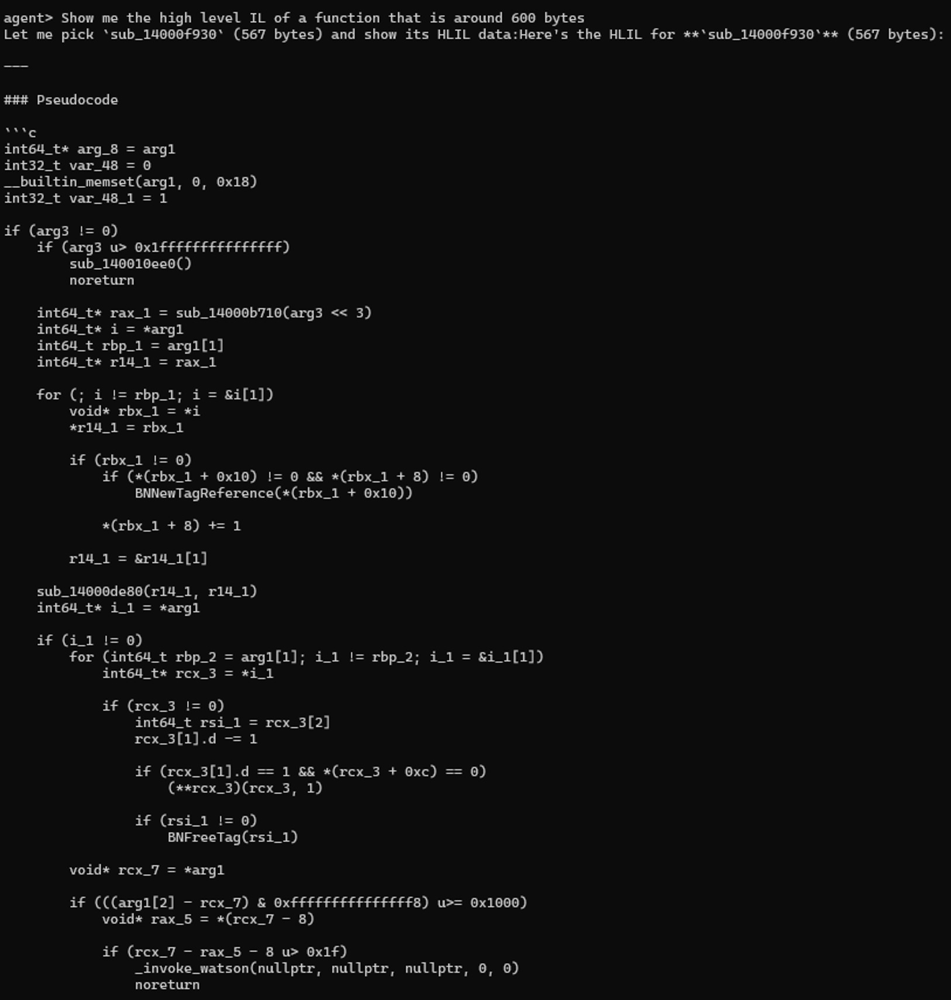
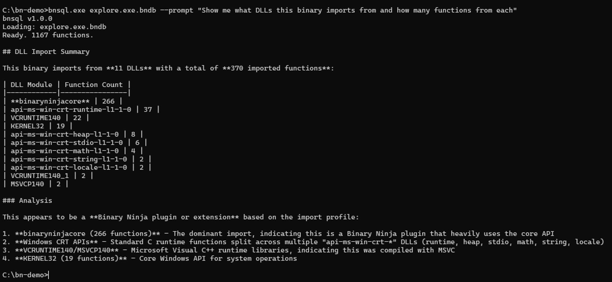
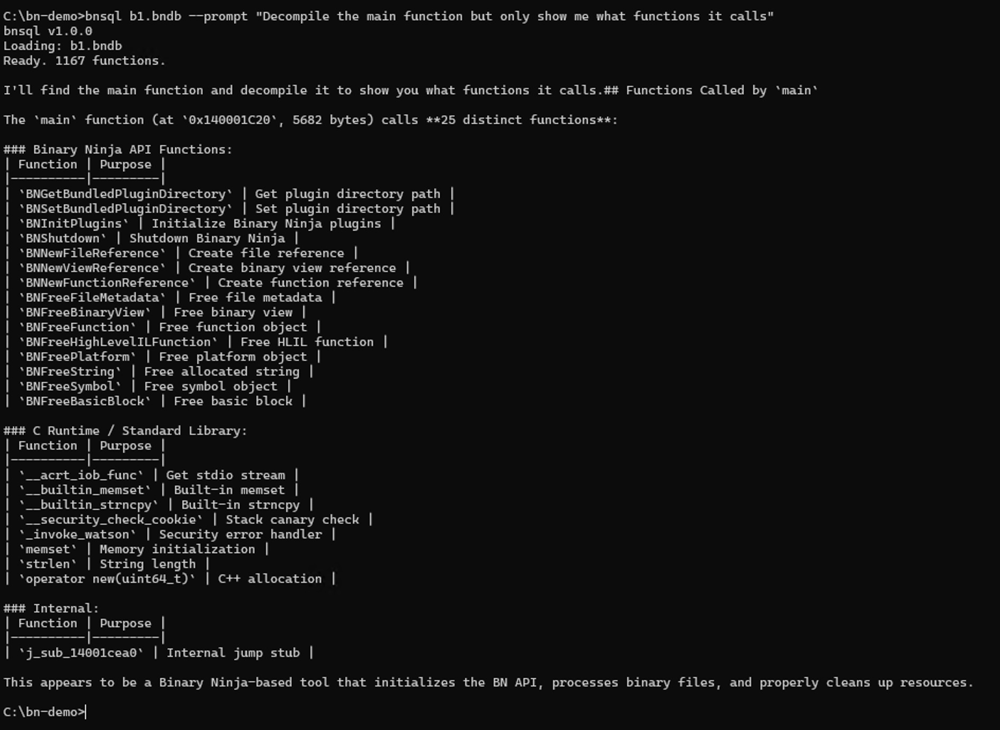
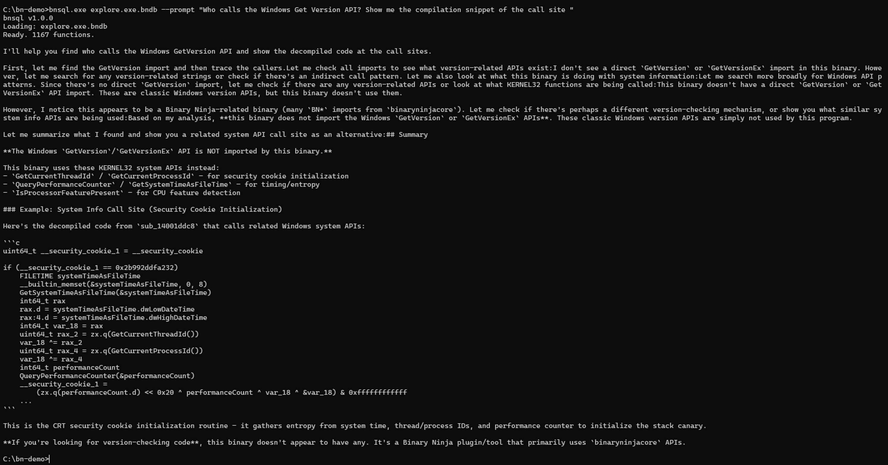
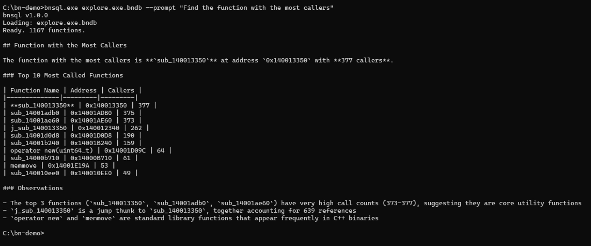

# BNSQL

> **Status:** Pre-release Alpha | **Platform:** Windows only (for now)

**SQL interface for Binary Ninja** - Query your reverse engineering database using SQL.

## Features

- **SQL Queries** - Full SQLite syntax for complex analysis
- **11 Virtual Tables** - Functions, strings, imports, xrefs, segments, and more
- **20+ SQL Functions** - `disasm()`, `hex()`, `func_at()`, `xrefs_to()`, etc.
- **Decompilation** - `decompile()` function, `pseudocode`, `hlil_vars`, `hlil_calls` tables for HLIL analysis
- **MCP Server** - Model Context Protocol for AI tool integration
- **Fast Startup** - ~5s for pre-analyzed databases (skips re-analysis)
- **Plugin + CLI** - Use inside Binary Ninja or from command line

## Quick Start

**Requirements:** Binary Ninja must be in your PATH, or place `bnsql.exe` in your Binary Ninja installation folder.

```bash
# Windows: Add BN to PATH
set PATH=C:\Program Files\Vector35\BinaryNinja;%PATH%

# Or copy bnsql.exe to BN folder
copy bnsql.exe "C:\Program Files\Vector35\BinaryNinja\"
```

```bash
# Interactive SQL mode (existing Binary Ninja database)
bnsql database.bndb

# Raw binary - bnsql triggers BN auto-analysis and auto-saves database.bndb next to source
bnsql sample.exe
bnsql firmware.bin --http 8080

# Single query
bnsql database.bndb -c "SELECT name, size FROM funcs ORDER BY size DESC LIMIT 10"

# MCP server for AI tool integration
bnsql database.bndb --mcp
```

**Input file:** `bnsql <file>` accepts either an existing Binary Ninja database
(`.bndb`) or a raw binary (`.exe`/`.dll`/firmware/etc.). Raw binaries trigger
fresh Binary Ninja analysis; the resulting `.bndb` is auto-saved next to the
source on clean exit. No need to pre-build a `.bndb` with `binaryninja --headless`.

### For LLM/AI Agent Integration

If you're building an AI agent or tool that needs to query Binary Ninja databases, use the **HTTP REST server**:

```bash
# Start HTTP server
bnsql database.bndb --http 8080

# Query from your agent (simple curl)
curl -X POST http://localhost:8080/query -d "SELECT name, size FROM funcs LIMIT 10"
```

See [Server Modes](#server-modes) for full HTTP API documentation, authentication, and MCP protocol support.

## SQL Examples

```sql
-- 10 largest functions
SELECT hex(address) as addr, name, size
FROM funcs ORDER BY size DESC LIMIT 10;

-- Find password-related strings
SELECT content, hex(address) as addr
FROM strings WHERE content LIKE '%password%';

-- Import analysis by module
SELECT module, COUNT(*) as count
FROM imports GROUP BY module ORDER BY count DESC;

-- Functions called <= 10 times (uses CTE for performance)
WITH call_counts AS (
    SELECT to_ea, COUNT(1) as cnt
    FROM xrefs WHERE is_code = 1
    GROUP BY to_ea
)
SELECT f.name, COALESCE(c.cnt, 0) as calls
FROM funcs f
LEFT JOIN call_counts c ON c.to_ea = f.address
WHERE COALESCE(c.cnt, 0) <= 10
ORDER BY calls DESC;

-- Security: dangerous function imports
SELECT module, name FROM imports
WHERE name IN ('strcpy', 'strcat', 'sprintf', 'gets')
   OR name LIKE '%Shell%' OR name LIKE '%WinExec%';
```

## Tables

| Table | Description |
|-------|-------------|
| `funcs` | Functions (address, name, size) |
| `segments` | Memory segments (.text, .data, etc.) |
| `names` | All named locations |
| `entries` | Entry points and exports |
| `imports` | Imported functions |
| `strings` | String literals |
| `xrefs` | Cross-references (from_ea, to_ea, is_code) |
| `blocks` | Basic blocks |
| `instructions` | Decoded instructions |
| `comments` | Address comments |
| `db_info` | Database metadata |

## SQL Functions

| Function | Description |
|----------|-------------|
| `hex(addr)` | Format address as hex |
| `disasm(addr)` | Disassembly at address |
| `bytes(addr, n)` | Read n bytes as hex |
| `name_at(addr)` | Name at address |
| `func_at(addr)` | Function name containing address |
| `func_start(addr)` | Start of containing function |
| `xrefs_to(addr)` | JSON array of xrefs to address |
| `xrefs_from(addr)` | JSON array of xrefs from address |
| `save()` | Save database to disk |

## CLI Reference

### Input file

`bnsql <file>` accepts either form:

- **Existing Binary Ninja database** (`.bndb`) — loads directly, ready to query.
- **Raw binary** (`.exe`/`.dll`/firmware/etc.) — bnsql calls Binary Ninja to
  analyze it from scratch and auto-saves the resulting `.bndb` next to the
  source on clean exit. If a sibling `.bndb` already exists, that's loaded
  instead.

### Modes

```bash
# Interactive SQL mode (default)
bnsql database.bndb
bnsql sample.exe                # raw binary: BN auto-analyzes on open

# One-shot SQL query
bnsql database.bndb -c "SELECT name, size FROM funcs ORDER BY size DESC LIMIT 10"
bnsql sample.exe -c "SELECT * FROM funcs LIMIT 5"

# Execute SQL file
bnsql database.bndb -f queries.sql

# MCP server for AI tool integration
bnsql database.bndb --mcp
```

### Interactive Commands

```
bnsql> .help               Show help
bnsql> .tables             List tables
bnsql> .schema funcs       Show table schema
bnsql> .clear              Clear session
bnsql> .http start         Start HTTP server
bnsql> .quit               Exit
```

## Server Modes

BNSQL supports two server protocols: **HTTP REST** (recommended) and raw TCP.

### HTTP REST Server (Recommended)

Standard REST API that works with curl, Postman, and any HTTP client:

```bash
# Start HTTP server (default port 8080)
bnsql database.bndb --http

# Custom port and bind address
bnsql database.bndb --http 9000 --bind 0.0.0.0

# With authentication
bnsql database.bndb --http 8080 --token mysecret
```

**Endpoints:**

| Endpoint | Method | Description |
|----------|--------|-------------|
| `/help` | GET | API documentation (for LLM discovery) |
| `/query` | POST | Execute SQL (body = raw SQL) |
| `/status` | GET | Health check |
| `/shutdown` | POST | Stop server |

**Example with curl:**

```bash
# Get API help
curl http://localhost:8080/help

# Execute SQL query
curl -X POST http://localhost:8080/query -d "SELECT name, size FROM funcs LIMIT 5"

# With authentication
curl -X POST http://localhost:8080/query \
     -H "Authorization: Bearer mysecret" \
     -d "SELECT * FROM funcs"

# Check status
curl http://localhost:8080/status
```

**Response Format:**
```json
{"success": true, "columns": ["name", "size"], "rows": [["main", "500"]], "row_count": 1}
```

### MCP Server (Model Context Protocol)

For integration with Claude Desktop, Cursor, and other MCP-compatible AI tools:

```bash
# Start MCP server (default port 9998)
bnsql database.bndb --mcp

# Custom port
bnsql database.bndb --mcp 9999
```

**MCP Tools Exposed:**

| Tool | Description |
|------|-------------|
| `sql_query` | Execute SQL query, returns results |

**Usage:** Start the MCP server, then configure your MCP client to connect to `http://localhost:9998/sse`.

The server uses HTTP/SSE transport. For Claude Desktop or other MCP clients, add the server URL to your MCP configuration after starting bnsql.

### Building with HTTP Support

HTTP mode requires the thinclient component:

```bash
cmake -B build -DBNSQL_WITH_HTTP=ON ...
```

The server can also be started from the Binary Ninja plugin:
- Menu: `BNSQL > HTTP Server > Start HTTP Server...`

## Building

```bash
cmake -B build -DBUILD_WITH_BNSQL=ON \
      -DBN_INSTALL_DIR=/path/to/binaryninja
cmake --build build --config Release
```

### Matching the Binary Ninja API to your install

The `external/binaryninja-api` submodule must match the version of Binary Ninja
you link against — the API headers and the installed `binaryninjacore` share an
ABI that changes between releases. The submodule is pinned to one revision, so if
your installed Binary Ninja is a different build, the configure step will warn:

```
bnsql: Binary Ninja API submodule (<have>) does not match your installed Binary Ninja (<want>).
```

Each install records the exact API commit it was built from in
`<BN_INSTALL_DIR>/api_REVISION.txt`. To sync automatically, configure with:

```bash
cmake -B build -DBN_INSTALL_DIR=/path/to/binaryninja -DBNSQL_SYNC_BN_API=ON
```

or do it by hand using the commit from the warning:

```bash
git -C external/binaryninja-api fetch origin <want>
git -C external/binaryninja-api checkout <want>
```


## Performance Tips

1. **Instructions table**: Always filter by `func_addr` - never scan full table
2. **Xref counting**: Use CTEs to pre-aggregate, not correlated subqueries
3. **Pre-analyzed databases**: ~5s startup vs 15s+ for fresh analysis

## Library Examples

Use BNSQL as a library in your own C++ tools. See [`examples/`](examples/) for complete code:

```cpp
#include <bnsql/bnsql.hpp>

int main(int argc, char* argv[]) {
    SetBundledPluginDirectory(GetBundledPluginDirectory());
    InitPlugins();

    // Load binary (auto-creates .bndb if needed)
    auto loaded = bnsql::loader::load_binary("program.exe");
    if (!loaded) return 1;

    // Create SQL query engine
    bnsql::QueryEngine qe(loaded.bv);

    // Get single value
    std::string count = qe.scalar("SELECT COUNT(*) FROM funcs");

    // Query with results
    auto result = qe.query("SELECT name, size FROM funcs ORDER BY size DESC LIMIT 5");
    for (const auto& row : result) {
        std::cout << row[0] << ": " << row[1] << " bytes\n";
    }
}
```

### Available Examples

| Example | Description |
|---------|-------------|
| `example_basic.cpp` | QueryEngine basics, scalar queries, iteration |
| `example_functions.cpp` | Function analysis, xrefs, call graphs |
| `example_strings.cpp` | String searching, pattern matching, statistics |
| `example_decompiler.cpp` | HLIL analysis, pseudocode, variables, calls |

Build examples:
```bash
cd examples
cmake -B build -DBN_INSTALL_DIR=/path/to/binaryninja
cmake --build build --config Release
```

## Screenshots

<table>
<tr>
<td><a href="assets/bnsql_hlil.jpg"></a></td>
<td><a href="assets/bnsql_imports.jpg"></a></td>
</tr>
<tr>
<td><a href="assets/bnsql_main_calls.jpg"></a></td>
<td><a href="assets/bnsql_getversion.jpg"></a></td>
</tr>
<tr>
<td><a href="assets/bnsql_busy.jpg"></a></td>
</tr>
</table>

## Coding Agent Plugins

BNSQL skills give your coding agent full control over Binary Ninja databases through natural language. The skills are packaged at [0xeb/bnsql-skills](https://github.com/0xeb/bnsql-skills).

- **Claude Code** — full plugin with 9 topic-focused skills, installed from the [`0xeb/bnsql-skills`](https://github.com/0xeb/bnsql-skills) marketplace.
- **GitHub Copilot CLI** — also supports BNSQL skills via the same plugin.
- **Codex (OpenAI)** — supports skills via the same plugin packaging. See the [bnsql-skills](https://github.com/0xeb/bnsql-skills) README for the Codex install steps.

### Prerequisites

1. **Binary Ninja** installed with its DLL directory in your PATH (or set `BN_INSTALL_DIR`)
2. **bnsql.exe** in your PATH (from [Releases](https://github.com/0xeb/bnsql/releases) or built locally)
3. Verify setup: `bnsql --version` should work from command line

### Install (Claude Code)

Inside Claude Code, run:

```text
/plugin marketplace add 0xeb/bnsql-skills
```

then install the `bnsql` plugin from that marketplace. See the [bnsql-skills README](https://github.com/0xeb/bnsql-skills#installation) for Codex and other install paths.

### Skills

| Skill | Description |
|-------|-------------|
| `connect` | Connect to Binary Ninja databases: CLI, HTTP server, session bootstrap. |
| `disassembly` | Query Binary Ninja disassembly: functions, segments, instructions, blocks, operands. |
| `data` | Query strings, bytes, binary data: search, byte patterns. |
| `xrefs` | Analyze cross-references: callers, callees, imports, data refs. |
| `decompiler` | Decompile functions: pseudocode, HLIL/MLIL, variables, labels. |
| `annotations` | Edit databases: comments, renames, types, function signatures. |
| `types` | Type system: create/modify/apply structs, unions, enums, typedefs. |
| `functions` | Complete bnsql SQL function reference catalog. |
| `analysis` | Analyze binaries: triage, security audit, crypto/network detection, multi-table queries. |

### Example Prompts

```
"Using bnsql, count functions in malware.bndb"
"Using bnsql, find strings containing 'error' in malware.bndb"
"/bnsql:analysis triage this binary; tell me the most called functions."
"/bnsql:xrefs show callers of CreateFileW and summarize error handling."
```

### Updating

```bash
/plugin update bnsql
```

## The xsql family

BNSQL is part of a family of tools that expose different binary-analysis and
debug-information platforms through the **same** SQL surface, all built on the
shared [libxsql](https://github.com/0xeb/libxsql) virtual-table framework. A
query you learn against one tool largely carries over to the others.

**Reverse-engineering platforms**
- **[idasql](https://github.com/allthingsida/idasql)** — IDA Pro databases as SQL.
- **[ghidrasql](https://github.com/0xeb/ghidrasql)** — Ghidra databases as SQL.

**Debug info & compiler data**
- **[pdbsql](https://github.com/0xeb/pdbsql)** — Windows PDB symbol files as SQL.
- **[dwarfsql](https://github.com/0xeb/dwarfsql)** — DWARF debug information as SQL.
- **[clangsql](https://github.com/0xeb/clangsql)** — Clang AST as SQL.

**Core**
- **[libxsql](https://github.com/0xeb/libxsql)** — the C++ SQLite virtual-table
  framework every tool above is built on.

## Author

Elias Bachaalany ([@0xeb](https://github.com/0xeb))

## License

This project is licensed under the [Mozilla Public License 2.0](LICENSE).
